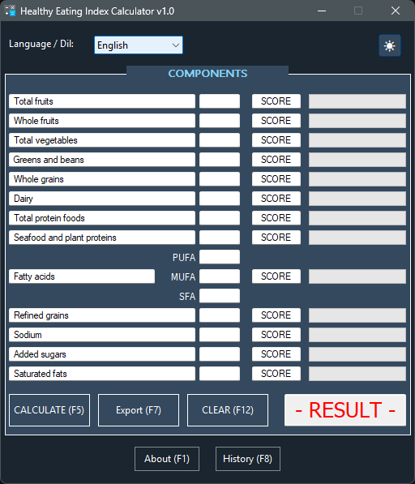
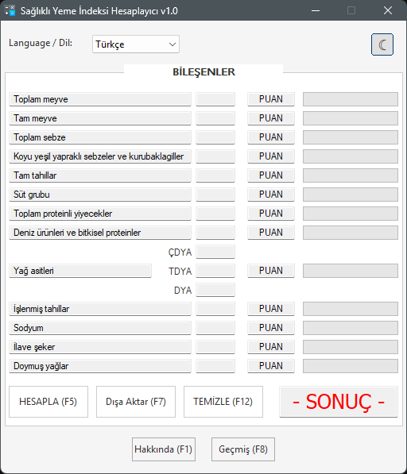
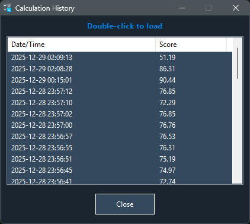
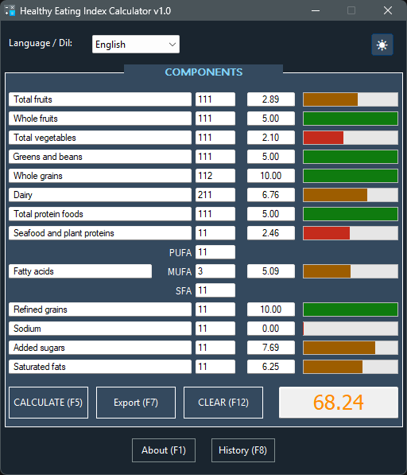

# 🥗 HEI Calculator (HEI-2015)

   

**HEI Calculator**, beslenme verilerini HEI-2015 (Healthy Eating Index) bilimsel standartlarına göre analiz eden, çoklu dil destekli ve modern arayüze sahip profesyonel bir masaüstü uygulamasıdır.

**HEI Calculator** is a professional desktop application that analyzes nutritional data based on HEI-2015 scientific standards, featuring multi-language support and a modern dark/light UI.

---

## 🌟 Özellikler / Features

Bu uygulama, standart bir hesap makinesinin ötesine geçerek gelişmiş kullanıcı deneyimi sunar:
This application goes beyond a standard calculator to offer an enhanced user experience:

### 🎨 Modern UI & UX
* **Dark & Light Mode:** Göz yormayan gece modu ve ferah gündüz modu arasında anlık geçiş (`settings.ini` ile kaydedilir).
* **Ghost Design:** Windows'un standart butonları yerine modern, düz ve şık "Ghost" buton tasarımı.
* **Visual Feedback:** Her bileşen için puan durumuna göre renk değiştiren (Kırmızı/Sarı/Yeşil) görsel ilerleme çubukları.

### ⚙️ Teknik Yetenekler / Technical Capabilities
* **Real-time Validation:** Hatalı veri girişini engelleyen anlık karakter kontrolü.
* **Smart History:** Hesaplamaları tarih ve saatle birlikte otomatik kaydeder. Çift tıklayarak eski hesaplamalar tekrar yüklenebilir.
* **Data Persistence:** Dil ve Tema tercihleri `settings.ini`, hesaplama geçmişi `history.ini` dosyasında tutulur.
* **Export Engine:** Sonuçları detaylı bir rapor halinde `.txt` veya `.csv` formatında dışa aktarır.

### 🌍 Çoklu Dil / Multi-language
* **TR/EN Support:** Tek tıkla Türkçe ve İngilizce arasında geçiş imkanı.

---

## 📸 Ekran Görüntüleri / Screenshots

| Dark Mode (Ana Ekran) | Light Mode |
|:---:|:---:|
|  |  |

| Geçmiş (History) | Sonuç (Result) |
|:---:|:---:|
|  |  |

## 🚀 Kurulum ve Kullanım / Installation & Usage

Bu uygulama **Portable (Taşınabilir)** yapıdadır. Kurulum gerektirmez.
This application is portable. No installation required.

1.  **İndirin:** `HEI_Calculator.exe` dosyasını bilgisayarınıza indirin.
2.  **Çalıştırın:** Çift tıklayarak uygulamayı başlatın.
3.  **Hazır:** Uygulama ilk açıldığında gerekli ayar dosyalarını (`settings.ini` ve `history.ini`) bulunduğu klasörde otomatik oluşturacaktır.

---

## 📊 HEI-2015 Bileşenleri / Components

Uygulama aşağıdaki 13 temel beslenme bileşenini analiz eder:
The application analyzes the following 13 core nutritional components:

1.  **Total Fruits** (Toplam Meyve)
2.  **Whole Fruits** (Tam Meyve)
3.  **Total Vegetables** (Toplam Sebze)
4.  **Greens and Beans** (Yeşil Yapraklı Sebzeler ve Baklagiller)
5.  **Whole Grains** (Tam Tahıllar)
6.  **Dairy** (Süt Grubu)
7.  **Total Protein Foods** (Toplam Protein)
8.  **Seafood and Plant Proteins** (Deniz Ürünleri ve Bitkisel Protein)
9.  **Fatty Acids** (Yağ Asitleri - PUFA/MUFA/SFA oranı)
10. **Refined Grains** (İşlenmiş Tahıllar - *Ters Puanlama*)
11. **Sodium** (Sodyum - *Ters Puanlama*)
12. **Added Sugars** (İlave Şeker - *Ters Puanlama*)
13. **Saturated Fats** (Doymuş Yağlar - *Ters Puanlama*)

---

## ⚠️ Yasal Uyarı / Disclaimer

Bu yazılım sadece bilgilendirme ve eğitim amaçlıdır. Hesaplanan sonuçlar **tıbbi tavsiye niteliği taşımaz**. Diyetinizde değişiklik yapmadan önce mutlaka bir diyetisyene veya doktora danışınız.

This software is for informational and educational purposes only. The calculated results **do not constitute medical advice**. Please consult a dietitian or doctor before making changes to your diet.

---

## 📄 Lisans / License

**Freeware (Ücretsiz Yazılım)**
Bu program ücretsiz olarak kullanılabilir ve dağıtılabilir. Kaynak kodu kapalıdır. Tersine mühendislik yapılması, kodun değiştirilmesi veya programın ücretli olarak satılması yasaktır.

**Freeware**
This program is free to use and distribute. The source code is closed. Reverse engineering, modification of the code, or selling the program for profit is prohibited.

---

## 👨‍💻 Geliştirici / Developer

* **Developer:** Eagle
* **Contact:** trup40@protonmail.com
* **Copyright:** © 2025 All Rights Reserved.

---

*Built with AutoIt v3*
