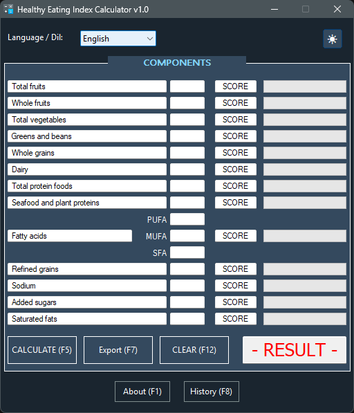
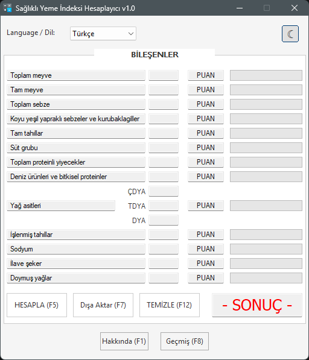
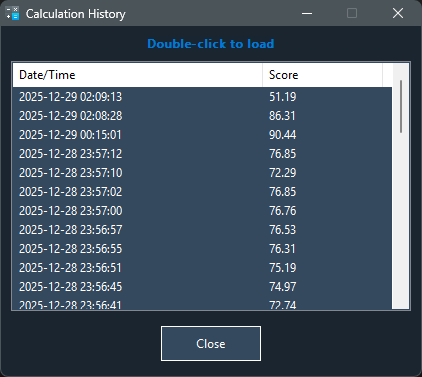
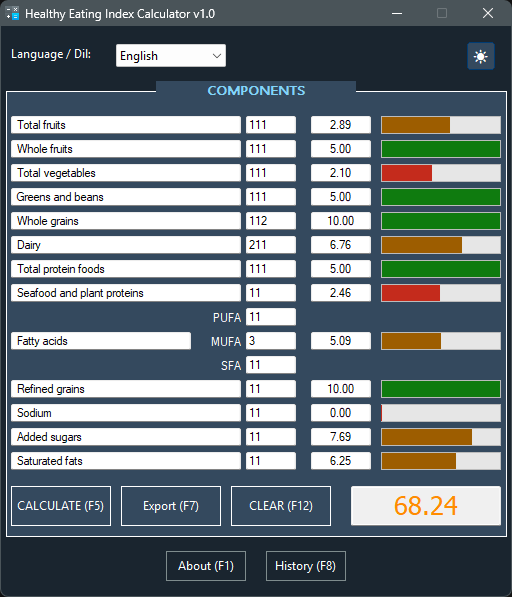

# 🥗 HEI Calculator (HEI-2015)

   

   
  <a href="README.md">English</a> | <a href="README.tr.md">Türkçe</a>

**HEI Calculator**, beslenme verilerini HEI-2015 (Healthy Eating Index) bilimsel standartlarına göre analiz eden, çoklu dil destekli ve modern arayüze sahip profesyonel bir masaüstü uygulamasıdır.

---

## 🌟 Özellikler

Bu uygulama, standart bir hesap makinesinin ötesine geçerek gelişmiş kullanıcı deneyimi sunar:

### 🎨 Modern Arayüz ve Kullanıcı Deneyimi (UI & UX)
* **Koyu ve Açık Mod:** Göz yormayan gece modu ve ferah gündüz modu arasında anlık geçiş (`settings.ini` ile kaydedilir).
* **Hayalet Tasarım (Ghost Design):** Windows'un standart butonları yerine modern, düz ve şık "Ghost" buton tasarımı.
* **Görsel Geribildirim:** Her bileşen için puan durumuna göre renk değiştiren (Kırmızı/Sarı/Yeşil) görsel ilerleme çubukları.

### ⚙️ Teknik Yetenekler
* **Gerçek Zamanlı Doğrulama:** Hatalı veri girişini engelleyen anlık karakter kontrolü.
* **Akıllı Geçmiş:** Hesaplamaları tarih ve saatle birlikte otomatik kaydeder. Çift tıklayarak eski hesaplamalar tekrar yüklenebilir.
* **Veri Kalıcılığı:** Dil ve Tema tercihleri `settings.ini`, hesaplama geçmişi `history.ini` dosyasında tutulur.
* **Dışa Aktarma Motoru:** Sonuçları detaylı bir rapor halinde `.txt` veya `.csv` formatında dışa aktarır.

### 🌍 Çoklu Dil
* **TR/EN Desteği:** Tek tıkla Türkçe ve İngilizce arasında geçiş imkanı.

---

## 📸 Ekran Görüntüleri

| Koyu Mod (Ana Ekran) | Açık Mod |
|:---:|:---:|
|  |  |

| Geçmiş | Sonuç |
|:---:|:---:|
|  |  |

## 🚀 Kurulum ve Kullanım

Bu uygulama **Portable (Taşınabilir)** yapıdadır. Kurulum gerektirmez.

1.  **İndirin:** `HEI_Calculator.exe` dosyasını bilgisayarınıza indirin.
2.  **Çalıştırın:** Çift tıklayarak uygulamayı başlatın.
3.  **Hazır:** Uygulama ilk açıldığında gerekli ayar dosyalarını (`settings.ini` ve `history.ini`) bulunduğu klasörde otomatik oluşturacaktır.

---

## 📊 HEI-2015 Bileşenleri

Uygulama aşağıdaki 13 temel beslenme bileşenini analiz eder:

1.  **Toplam Meyve** (Total Fruits)
2.  **Tam Meyve** (Whole Fruits)
3.  **Toplam Sebze** (Total Vegetables)
4.  **Yeşil Yapraklı Sebzeler ve Baklagiller** (Greens and Beans)
5.  **Tam Tahıllar** (Whole Grains)
6.  **Süt Grubu** (Dairy)
7.  **Toplam Protein** (Total Protein Foods)
8.  **Deniz Ürünleri ve Bitkisel Protein** (Seafood and Plant Proteins)
9.  **Yağ Asitleri** (PUFA/MUFA/SFA oranı)
10. **İşlenmiş Tahıllar** (*Ters Puanlama*)
11. **Sodyum** (*Ters Puanlama*)
12. **İlave Şeker** (*Ters Puanlama*)
13. **Doymuş Yağlar** (*Ters Puanlama*)

---

## ⚠️ Yasal Uyarı

Bu yazılım sadece bilgilendirme ve eğitim amaçlıdır. Hesaplanan sonuçlar **tıbbi tavsiye niteliği taşımaz**. Diyetinizde değişiklik yapmadan önce mutlaka bir diyetisyene veya doktora danışınız.

---

## 📄 Lisans

**Freeware (Ücretsiz Yazılım)**
Bu program ücretsiz olarak kullanılabilir ve dağıtılabilir. Kaynak kodu kapalıdır. Tersine mühendislik yapılması, kodun değiştirilmesi veya programın ücretli olarak satılması yasaktır.

---

## 👨‍💻 Geliştirici

* **Geliştirici:** Eagle
* **İletişim:** trup40@protonmail.com
* **Telif Hakkı:** © 2025 Tüm Hakları Saklıdır.

---

*AutoIt v3 ile geliştirilmiştir.*

## ☕ Bağış Yap

Geliştirdiğim bu yazılım tamamen ücretsiz ve açık kaynaklıdır. Eğer projem işinize yaradıysa, bana bir kahve ısmarlayarak çalışmalarıma destek olabilirsiniz! 🚀

### 🪙 Kripto Para Adreslerim

| Coin | Ağ (Network) | Cüzdan Adresi |
| :--- | :--- | :--- |
| **USDT (Tether)** | **TRC20** (Tron) | `TWxJVQ3PBCd8ZJJVkX2joe8WRGcSCdh8Ws` |
| **BTC (Bitcoin)** | Bitcoin (Bech32)| `bc1q7207qk3wk94a94xvxx43lxawsg69zpm0atvtd8` |
| **ETH (Ethereum)** | ERC20 | `0x1f5A2e35752c6f01c753F334292Fc7635Caeef56` |
| **BNB** | **BSC** (BEP20) | `0x93845c5Fb889C36E072B5683f1616C625C2deBe7` |

> [!IMPORTANT]
> Lütfen gönderim yaparken **Ağ (Network)** seçiminin yukarıdaki tablo ile birebir aynı olduğundan emin olun. Yanlış ağ seçimi varlık kaybına neden olabilir.
